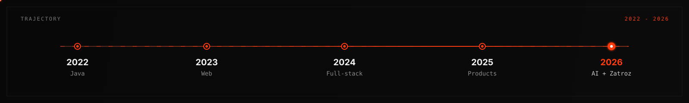

<!-- YUVARAJAH DIVEJIKAN · AI Software Engineer · Zatroz -->

  

  

  <a href="#profile">Profile</a>
  &nbsp;·&nbsp;
  <a href="#systems">Systems</a>
  &nbsp;·&nbsp;
  <a href="#work">Work</a>
  &nbsp;·&nbsp;
  <a href="#recognition">Recognition</a>
  &nbsp;·&nbsp;
  <a href="#stack">Stack</a>
  &nbsp;·&nbsp;
  <a href="#connect">Connect</a>

  
  
  
  

  

## Profile

<table>
  <tr>
    <td width="58%" valign="top">

I build software that can reason, retrieve, and act.

**BICT (Hons)** undergraduate at South Eastern University of Sri Lanka. Co-founder of **Zatroz**. Working toward becoming an **AI Software Engineer** who can take a product from API and infrastructure through to an intelligent production layer.

`Software Engineering × AI × Automation → real products`

    </td>
    <td width="42%" valign="top">

**Now**

- RAG, agents, and MCP
- Java / Spring Boot
- React / Next.js
- Cloud and automation
- Shipping via **Zatroz**

    </td>
  </tr>
</table>

  

## Systems

  

## Work

<table>
  <tr>
    <td width="50%" valign="top">

**FlowPilot AI**  
AI financial assistant for SMEs.  
1st Place, FinTech — Cursor Buildathon Colombo 2026.

`AI` `LLM` `FinTech`

[Repository](https://github.com/divejikan-yuvarajah/FlowPilotAI)

    </td>
    <td width="50%" valign="top">

**MediGuardian AI**  
Healthcare assistant for safer access to medical information.

`AI` `GenAI` `Next.js`

[Repository](https://github.com/divejikan-yuvarajah/MediGuardian-AI)

    </td>
  </tr>
  <tr>
    <td width="50%" valign="top">

**HireQueue**  
Recruitment platform for candidate and recruiter workflows.

`Full-Stack` `Web`

[Repository](https://github.com/divejikan-yuvarajah/hirequeue-job-platform)

    </td>
    <td width="50%" valign="top">

**InvoiceX AI**  
Invoice pipeline: OCR → structured data → insight.

`AI` `OCR` `n8n`

    </td>
  </tr>
</table>

  

  

## Zatroz

Co-founder of **Zatroz**. We build practical software for businesses — web, mobile, POS, and AI automation — with a longer bet on **AI-powered operations software for SMEs**.

## Recognition

<table>
  <tr>
    <td width="50%" valign="top">

**Cursor Buildathon Colombo 2026**  
1st Place — FinTech  
FlowPilot AI · Team ZeroDB

    </td>
    <td width="50%" valign="top">

**Interfaculty Designathon 2026**  
1st Runner Up  
Team NeuraForm

    </td>
  </tr>
  <tr>
    <td width="50%" valign="top">

**IDEALIZE**  
Semi Finalist

    </td>
    <td width="50%" valign="top">

**IEEE Innovation Nation Sri Lanka**  
Quarter Finalist · Zatroz

    </td>
  </tr>
</table>

## Stack

<table>
  <tr>
    <td width="33%" valign="top" align="center">
      

        <strong>Languages</strong> 
        
      

    </td>
    <td width="33%" valign="top" align="center">
      

        <strong>Backend</strong> 
        
      

    </td>
    <td width="33%" valign="top" align="center">
      

        <strong>Frontend</strong> 
        
      

    </td>
  </tr>
  <tr>
    <td width="33%" valign="top" align="center">
      

        <strong>Data</strong> 
        
      

    </td>
    <td width="33%" valign="top" align="center">
      

        <strong>AI / ML</strong> 
        
      

    </td>
    <td width="33%" valign="top" align="center">
      

        <strong>Cloud</strong> 
        
      

    </td>
  </tr>
</table>

  

## Activity

<table>
  <tr>
    <td width="50%" valign="top" align="center">
      

        
      

    </td>
    <td width="50%" valign="top" align="center">
      

        
      

    </td>
  </tr>
</table>

  

## Trajectory

  

## Connect

Open to software engineering roles, AI product work, and focused collaboration.

  
  
  
  

  

