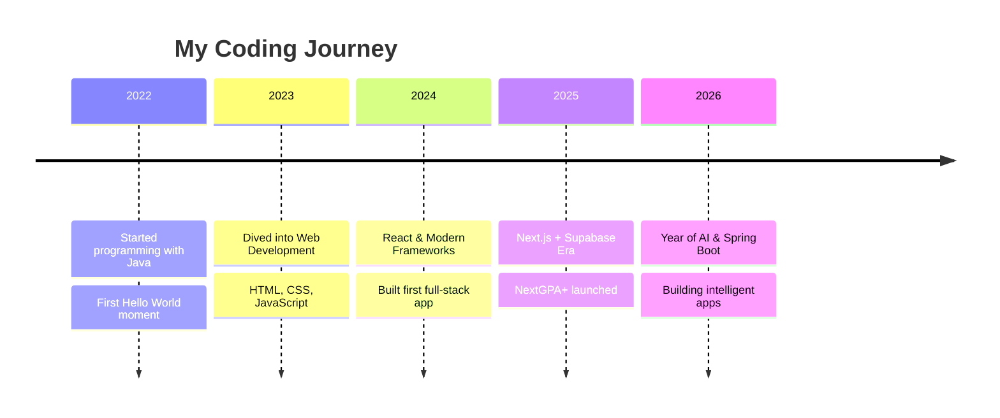

<!-- =========================================================
🌌 YUVARAJAH DIVEJIKAN — GitHub Profile README (Cyan Edition)
========================================================= -->

<!-- 🌠 SELF-HOSTED ANIMATED HEADER BANNER (commit header.svg to assets/) -->
<p align="center">
  
</p>

<!-- ✨ Holographic Typing Animation -->
<p align="center">
  
</p>

<!-- 🌈 Glowing Identity Badges -->
<p align="center">
  
  
  
  
  
</p>

<!-- 👀 Live Counters -->
<p align="center">
  
  
  
</p>

<!-- 🧭 Quick Navigation -->
<p align="center">
  <a href="#-about-me">About</a> &nbsp;•&nbsp;
  <a href="#-current-focus--2026-goals">Goals</a> &nbsp;•&nbsp;
  <a href="#%EF%B8%8F-tech-arsenal">Tech</a> &nbsp;•&nbsp;
  <a href="#-github-analytics-dashboard">Stats</a> &nbsp;•&nbsp;
  <a href="#-featured-projects">Projects</a> &nbsp;•&nbsp;
  <a href="#-connect-with-me">Connect</a>
</p>

<!-- 🌍 Animated Divider -->
<p align="center">
  
</p>

<br>

<!-- ────────────────────────────────────────────────────────── -->
## 🚀 About Me
<!-- ────────────────────────────────────────────────────────── -->


```yaml
👨‍💻 Developer Profile:
  name:        Yuvarajah Divejikan
  alias:       "Diveji"
  role:        IT Undergraduate
  location:    Sri Lanka 🇱🇰
  timezone:    UTC +5:30 (Asia/Colombo)
  focus:       [AI, Full-Stack, Data Science]
  currently:   Learning Spring Boot + Next.js + Supabase
  mission:     "Build intelligent, real-world applications"
  fuel:        ["☕ Coffee", "🎧 Lo-fi", "💡 Curiosity"]
  status:      🟢 Available for collaborations
  motto:       "Write. Build. Break. Learn. Repeat."
```

> 💡 **My Goal:** Grow into an **AI Software Engineer**, blending software engineering, machine learning, data processing, and modern AI technologies into products that actually matter.

### 🧠 What I'm Exploring Right Now

<table>
<tr>
<td>🤖 <b>AI & Machine Learning</b></td>
<td>☕ <b>Java, Spring Boot & JavaFX</b></td>
</tr>
<tr>
<td>⚛️ <b>React, Next.js & Modern Web Dev</b></td>
<td>🗄️ <b>Supabase, PostgreSQL & MySQL</b></td>
</tr>
<tr>
<td>📊 <b>Turning Data into Insights</b></td>
<td>🧩 <b>Real-World Problem Solving</b></td>
</tr>
</table>

<br clear="right">

<!-- 〰️ Animated Divider -->


<!-- ────────────────────────────────────────────────────────── -->
## 🎯 Current Focus & 2026 Goals
<!-- ────────────────────────────────────────────────────────── -->

<table align="center">
<tr>
<td width="33%" valign="top" align="center">

### 🔭 Working On
**FlowPilotAI** 🚀
**EcoSphere AI** 🌱
AI-driven products & automation

</td>
<td width="33%" valign="top" align="center">

### 🌱 Learning
**Spring Boot Microservices**
**Next.js 15 + Server Actions**
**TensorFlow & PyTorch**

</td>
<td width="33%" valign="top" align="center">

### 🎯 2026 Goals
✅ Build 5 production-grade apps
⬜ Contribute to 3 open-source repos
⬜ Publish 10 technical blog posts
⬜ Land an AI/ML internship

</td>
</tr>
</table>

<!-- 〰️ Divider -->


<!-- ────────────────────────────────────────────────────────── -->
## 🛠️ Tech Arsenal
<!-- ────────────────────────────────────────────────────────── -->

<details open>
<summary><b>🔷 Programming Languages</b></summary>
<br>
<p align="center">
  
</p>
</details>

<details open>
<summary><b>⚙️ Backend & Frameworks</b></summary>
<br>
<p align="center">
  
  &nbsp;
  
</p>
</details>

<details open>
<summary><b>🎨 Frontend & UI</b></summary>
<br>
<p align="center">
  
</p>
</details>

<details open>
<summary><b>🗄️ Databases & Cloud</b></summary>
<br>
<p align="center">
  
</p>
</details>

<details open>
<summary><b>🧰 Tools & Platforms</b></summary>
<br>
<p align="center">
  
</p>
</details>

<details>
<summary><b>🤖 AI / ML / Data Stack (Learning)</b></summary>
<br>
<p align="center">
  
</p>
</details>

### 📈 Skill Proficiency


<br>

<!-- 〰️ Divider -->


<!-- ────────────────────────────────────────────────────────── -->
## 📊 GitHub Analytics Dashboard
<!-- ────────────────────────────────────────────────────────── -->

<p align="center">
  
  
</p>

<p align="center">
  
  
</p>

### 📦 Productivity Cards

<p align="center">
  
  
</p>

<p align="center">
  
  
</p>

### 🏆 Trophy Cabinet

<p align="center">
  
</p>

### 🐍 Contribution Snake

<p align="center">
  
</p>

### 📈 Activity Graph

<p align="center">
  
</p>

### 🧊 3D Contribution Calendar

<p align="center">
  
</p>

<br>

<!-- 〰️ Divider -->


<!-- ────────────────────────────────────────────────────────── -->
## 📦 Featured Projects
<!-- ────────────────────────────────────────────────────────── -->

<table>
<tr>
<td width="50%" valign="top">

### 🤖 FlowPilotAI
**AI-Powered Workflow Automation**

📘 An intelligent assistant that streamlines and automates workflows using AI.

🛠️ `AI` · `Automation` · `Full-Stack`

🔗 [**View Repository →**](https://github.com/divejikan-yuvarajah/FlowPilotAI)

</td>
<td width="50%" valign="top">

### 🌱 EcoSphere AI
**Sustainability-Focused AI Platform**

📘 An AI-driven platform promoting eco-friendly, sustainable solutions.

🛠️ `AI/ML` · `Data` · `Web`

🔗 [**View Repository →**](https://github.com/divejikan-yuvarajah/ecosphere-ai)

</td>
</tr>
<tr>
<td width="50%" valign="top">

### 💼 HireQueue
**Smart Job Platform**

📘 A modern job platform connecting candidates and recruiters with smart matching.

🛠️ `Full-Stack` · `Database` · `Web`

🔗 [**View Repository →**](https://github.com/divejikan-yuvarajah/hirequeue-job-platform)

</td>
<td width="50%" valign="top">

### 🔥 NextGPA+
**Smart GPA Tracker & Predictor**

📘 A modern web app for GPA calculation, analytics, prediction & PDF reports.

🛠️ `React` · `Next.js` · `Supabase` · `Tailwind`

🔗 [**View Repository →**](https://github.com/divejikan-yuvarajah/NextGPA-_Smart-GPA-tracking-Web-App)

</td>
</tr>
<tr>
<td colspan="2" align="center">
  <a href="https://github.com/divejikan-yuvarajah?tab=repositories">
    
  </a>
</td>
</tr>
</table>

### 📌 Pinned Repository Showcase

<p align="center">
  <a href="https://github.com/divejikan-yuvarajah/FlowPilotAI">
    
  </a>
  <a href="https://github.com/divejikan-yuvarajah/ecosphere-ai">
    
  </a>
</p>

<p align="center">
  <a href="https://github.com/divejikan-yuvarajah/hirequeue-job-platform">
    
  </a>
  <a href="https://github.com/divejikan-yuvarajah/NextGPA-_Smart-GPA-tracking-Web-App">
    
  </a>
</p>

<br>

<!-- 〰️ Divider -->


<!-- ────────────────────────────────────────────────────────── -->
## 📝 Latest Blog Posts
<!-- ────────────────────────────────────────────────────────── -->

<!-- BLOG-POST-LIST:START -->
🚧 *Coming soon on [Medium](https://medium.com/@Yuvarajah_Divejikan)*
<!-- BLOG-POST-LIST:END -->

<p align="center">
  <a href="https://medium.com/@Yuvarajah_Divejikan">
    
  </a>
</p>

<br>

<!-- 〰️ Divider -->


<!-- ────────────────────────────────────────────────────────── -->
## 💼 Developer Journey Timeline
<!-- ────────────────────────────────────────────────────────── -->



<br>

<!-- 〰️ Divider -->


<!-- ────────────────────────────────────────────────────────── -->
## 🌐 Connect With Me
<!-- ────────────────────────────────────────────────────────── -->

<p align="center">
  <a href="mailto:divejuthe@gmail.com">
    
  </a>
  <a href="https://www.linkedin.com/in/divejikan-yuvarajah-401526279">
    
  </a>
  <a href="https://www.instagram.com/diveji_yuva">
    
  </a>
  <a href="https://medium.com/@Yuvarajah_Divejikan">
    
  </a>
  <a href="https://github.com/divejikan-yuvarajah">
    
  </a>
</p>

<p align="center">
  <i>💬 Open to: Internships · Open-Source Collabs · Tech Discussions · Coffee Chats ☕</i>
</p>

<br>

<!-- ────────────────────────────────────────────────────────── -->
## 🎵 Coding Soundtrack
<!-- ────────────────────────────────────────────────────────── -->

<p align="center">
  <i>🎧 Currently fueling my code with Lo-fi beats & synthwave</i>
</p>

```
🎶 "Music + Code = Flow State Activated"
```

<br>

<!-- ────────────────────────────────────────────────────────── -->
## ✨ Fun Facts & Dev Philosophy
<!-- ────────────────────────────────────────────────────────── -->

<table align="center">
<tr>
<td>🕵️ Debugging = detective mode activated</td>
<td>☕ Coffee + Code = Happy Brain</td>
</tr>
<tr>
<td>🎯 Motto: <i>Write. Build. Break. Learn. Repeat.</i></td>
<td>🌟 Creativity + Data = My Favourite Combo</td>
</tr>
<tr>
<td>🚀 Always shipping. Always learning.</td>
<td>🧠 Every bug is a lesson in disguise</td>
</tr>
<tr>
<td>📚 Reading documentation > guessing</td>
<td>🌙 Best ideas hit at 2 AM</td>
</tr>
</table>

<br>

<!-- 💬 Random Dev Quote -->
<p align="center">
  
</p>

<br>

<!-- ────────────────────────────────────────────────────────── -->
## ☕ Support My Work
<!-- ────────────────────────────────────────────────────────── -->

<p align="center">
  <i>If you find my work valuable, consider supporting:</i>
</p>

<p align="center">
  <a href="https://www.buymeacoffee.com/divejikan">
    
  </a>
  <a href="https://github.com/divejikan-yuvarajah">
    
  </a>
</p>

<br>

<!-- 🌊 Footer Wave (self-hosted; reuse header.svg flipped, or keep capsule below) -->
<p align="center">
  
</p>

<p align="center">
  <i>⭐ If you like what I do, consider starring a repo or saying hi!</i>
  <br>
  <b>Let's build something amazing together 🚀</b>
</p>

<!-- 💫 Snake EOF -->
<p align="center">
  
</p>
